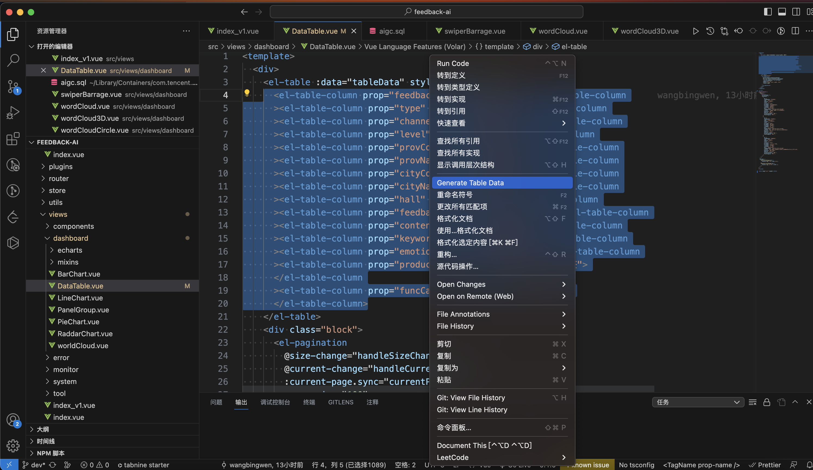

# element-mock README

A Visual Studio Code extension to generate table data from <el-table-column> code blocks.

## Features

This plugin is designed to assist programmers in generating mock data quickly for the `table` component in the Element UI library. Simply select the text containing `<el-table-column>` code blocks, right-click, and run the "Generate Table Data" command from the context menu. It will merge properties and labels to generate JSON data and insert it into the text editor. You can further customize and optimize the code as needed to meet specific requirements

> Tip: The Visual Studio Code version needs to be 1.81 or higher..

## Requirements

## Extension Settings

## Known Issues

Calling out known issues can help limit users opening duplicate issues against your extension.

## Release Notes

Users appreciate release notes as you update your extension.

### 1.0.0

Fixed Bug

## For more information

- [Visual Studio Code's Markdown Support](http://code.visualstudio.com/docs/languages/markdown)
- [Markdown Syntax Reference](https://help.github.com/articles/markdown-basics/)

**Enjoy!**
